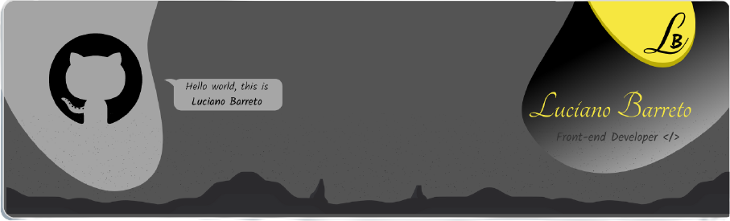

  

#
### Hello World!&nbsp; 

&nbsp;&nbsp;&nbsp;💬&nbsp;Sou o <strong>Luciano Barreto</strong>, desenvolvedor fullstack, tenho 40 anos, sou casado e professo a fé cristã, iniciei em 1992 o contato com o mundo tecnológico, ano este que marcou o fim da "Era Spectrum", os MSX's, o sistema DOS e o início da internet à sua feição atual, logo o desejo de aprender cada vez mais me impulsionou a fazer meu primeiro curso de habilitação profissional, tendo o contato com os pré-históricos Intel 286, 386...

&nbsp;&nbsp;&nbsp;💬&nbsp;Em 1999, após a conclusão do curso Técnico Desenvolvedor de Sistemas, tive contato com as linguagens de programação mais modernas da época, assim mergulhei na área da tecnologia que percorreu o contato direto até o ano de 2008.

&nbsp;&nbsp;&nbsp;💬&nbsp;Em 2019, depois de mudar para o ABC paulista, iniciei uma reciclagem, ingressei no curso bacharelado Ciências da Computação pela <strong>Universidade Anhembi Morumbi</strong>, entre outros paralelos à graduação, a de se mencionar os cursos desenvolvidos pela <strong>Unicamp, UC Davis (California US), Senai, Rocketseat, Digital Innovation One, LinkedIn Learning</strong>...

&nbsp;&nbsp;&nbsp;💬&nbsp;Mesmo tendo conhecimento em outras tecnologias, atualmente meu foco está nas linguagens JavaScript, NodeJS, ReactJS, React Native e Java (Android).👩‍💻

<table>
<tr>
    <td>
        
    </td>
    <td>
        
    </td>
</tr>   
</table>

  
  
  

 

  

<!--
**Lucianobarretto/Lucianobarretto** is a ✨ _special_ ✨ repository because its `README.md` (this file) appears on your GitHub profile.

Here are some ideas to get you started:

- 🔭 I’m currently working on ...
- 🌱 I’m currently learning ...
- 👯 I’m looking to collaborate on ...
- 🤔 I’m looking for help with ...
- 💬 Ask me about ...
- 📫 How to reach me: ...
- 😄 Pronouns: ...
- ⚡ Fun fact: ...
-->
